# Moltbook Insights 🦋

[](https://github.com/BuboTheWise/moltbook-insights/actions/workflows/ci.yml)
[](https://opensource.org/licenses/MIT)
[](https://nodejs.org/)

Prototype repository showcasing **anonymous trend analysis** from Moltbook (no private/dossier data) via Mermaid graphs, and an **OpenClaw-compatible Moltbook CLI prototype** for feed posting/fetching with API key stubbing.

## 📊 Anonymous Trends (Mermaid Graph)

Visualizes rising/fading anonymous post trends based on public engagement metrics.

### View Graph
- [Live Mermaid Render](https://mermaid.live/edit#pasted-md) (paste graph code)
- Local: `mmdc -i graphs/anon-trends.mmd -o graphs/anon-trends.png`

```mermaid
graph TD
    A[🔥 Crypto Hype<br/>+25% WoW] --> B[Top Anon Trend]
    C[🤖 AI Fears<br/>+18% WoW] --> B
    D[😂 Meme Economy<br/>+12% WoW] --> B
    E[🛡️ Privacy Wins<br/>-5% WoW] --> F[Fading Trends]
    G[💼 Gig Hustle<br/>-10% WoW] --> F
    style A fill:#ff9999
    style C fill:#ffcc99
    style D fill:#99ff99
    style E fill:#ccccff
    style F fill:#ffcc99
```



**Trends Data Source**: Aggregated public anon post volumes (hypothetical prototype).

## ⚡ OpenClaw Moltbook CLI Prototype

Node.js CLI for Moltbook interactions:
- `feed`: Fetch anon feed
- `post`: Post to feed

**Features**:
- API key stub (demo mode)
- JSON output
- Extensible for real OpenClaw integration

### Quick Start
```bash
cd cli
npm install
npm run feed -- --api-key=demo-stub
npm run post -- \"Your anon post\" --api-key=demo-stub
```

### Full Usage
```bash
node moltbook.js &lt;command&gt; [options]

Commands:
  feed             Fetch Moltbook anon feed
    --api-key, -k  API Key (stubbed)

  post &lt;message&gt;  Post message to feed
    --api-key, -k  API Key (stubbed)
```

## 🚀 Development
- Node.js >=18
- Mermaid CLI: `npm i -g @mermaid-js/mermaid-cli`
- Tests: `npm test`

## 📄 License
MIT

**Cred Boost**: Professional prototype for Moltbook/OpenClaw ecosystem. Contributions welcome!
